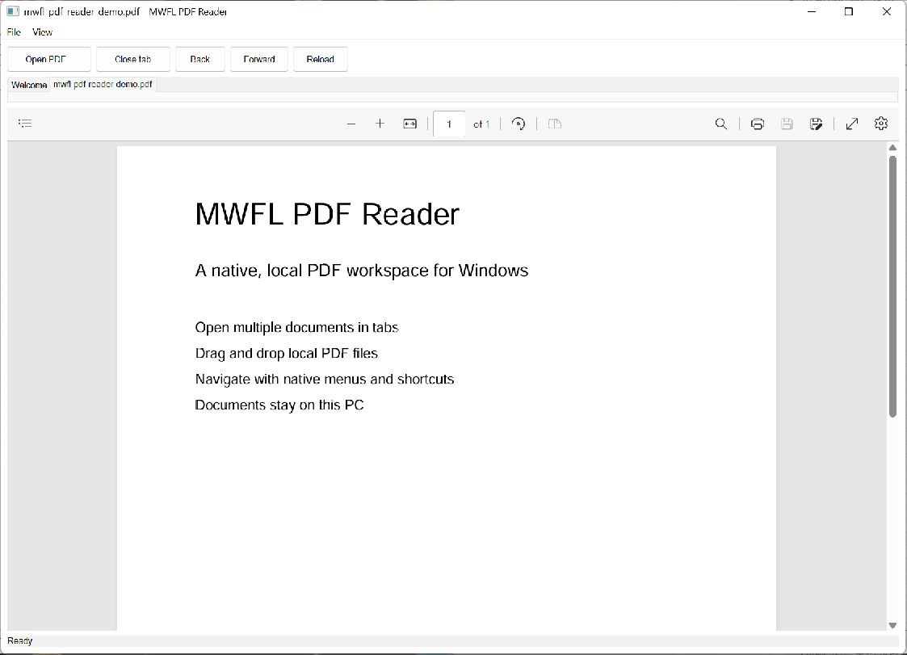

# MWFL PDF Reader

[](https://github.com/mwfl/pdf-reader/actions/workflows/ci.yml)

MWFL PDF Reader is a clean native Windows workspace for reading local PDF documents. It combines native tabs, menus, shortcuts, drag-and-drop, and recent files with the PDF engine provided by WebView2.



## Features

- Open several local PDFs in native document tabs.
- Drag and drop PDF files onto the window.
- Open a document directly with `pdf-reader.exe "C:\path\document.pdf"`.
- Recent-file menu and persisted window placement.
- Back, forward, reload, and standard WebView2 PDF controls.
- Automatic recovery when the renderer process stops.
- No upload or cloud service: documents remain local.

## Requirements

- Windows 10 or Windows 11, x64.
- Microsoft Edge WebView2 Runtime. Windows 11 normally includes it.

## Download

Download the versioned `windows-x64-portable.zip` from [GitHub Releases](https://github.com/mwfl/pdf-reader/releases), verify it with the accompanying SHA-256 file, and extract it anywhere. The Microsoft Edge WebView2 Runtime remains a system prerequisite.

## Build

```powershell
cmake --preset vs2026-x64
cmake --build --preset vs2026-x64-release
ctest --preset vs2026-x64-release
```

Visual Studio 2022 is also supported. A standalone `vs2022-x64` build fetches the pinned MWFL `v0.2.0` release and WebView2 SDK; the runtime itself remains a system prerequisite.

The automated test creates a valid one-page PDF, opens it through WebView2, verifies navigation and native tab state, and removes its temporary data afterward.

Use `pdf-reader.exe --showcase` to open a generated, disposable demonstration document.
